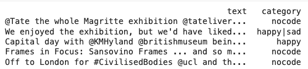
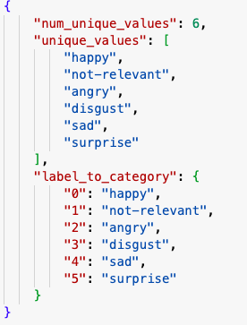
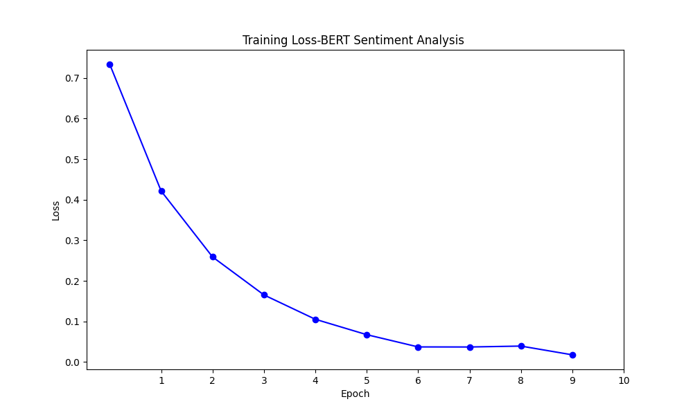
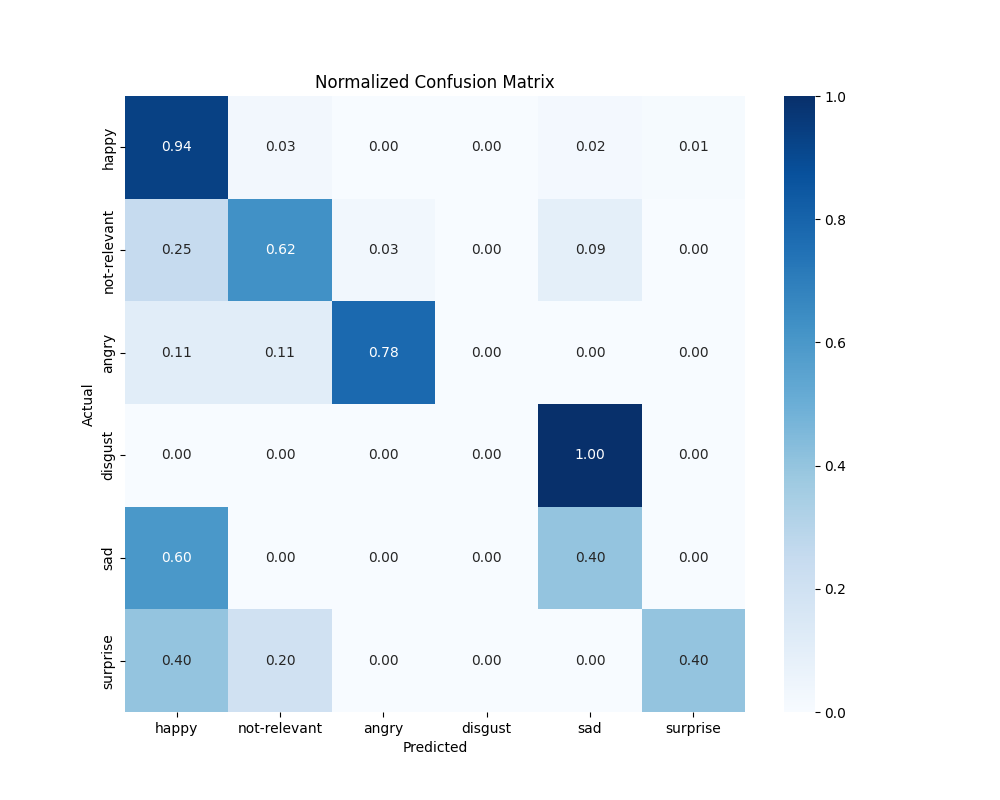

# BERT Sentiment Analysis on SMILE Twitter Dataset

This repository contains the implementation of a sentiment analysis model using the BERT (Bidirectional Encoder Representations from Transformers) architecture, fine-tuned on the SMILE Twitter dataset. The SMILE Twitter dataset, curated by Wang et al., encompasses a variety of tweets labeled with emotions, providing a rich source for sentiment analysis tasks.


## Dataset

The SMILE Twitter Emotion dataset was created by Wang, Bo; Tsakalidis, Adam; Liakata, Maria; Zubiaga, Arkaitz; Procter, Rob; Jensen, Eric in 2016. It includes tweets annotated with emotions such as happiness, anger, sadness, and others. For further details and to download the dataset, visit the [SMILE Twitter Emotion dataset page](https://doi.org/10.6084/m9.figshare.3187909.v2).

sample_data.png


## Installation

To run this project, ensure you have Python 3.6+ installed. Then, install the required packages using pip:

```
pip install -r requirements.txt
```

This command will install all necessary libraries, including `transformers`, `torch`, and others required for data processing and model training.

## Usage

### Data Preprocessing

First, preprocess the SMILE Twitter dataset to convert it into a format suitable for BERT training:

```
python preprocess.py 
```
This will save 2 files in data folder:   dataset_train.pt and dataset_val.pt with aNother file data_info.json that looks as follow:



### Model Training

To fine-tune the BERT model on the preprocessed dataset, run:

```
python train.py 
```

### Evaluation

Evaluate the model's performance on the evaluation  dataset:

```
python evaluate.py 
```

## Model

We utilize the `bert-base-uncased` model from the `transformers` library as our starting point, fine-tuning it on the emotion-labeled tweets. The fine-tuning process adjusts the pre-trained BERT model to better perform sentiment analysis specific to the SMILE dataset.


## Results

After fine-tuning, the model achieves a notable accuracy in classifying tweets into their respective emotion categories. Detailed results and analysis will be found in the `results` folder.




##  Inference from saved model

```
tweet = "I hate this movie"
label = predict_label(tweet)
print(f"Predicted label: {label}")
```

## Contribution

Contributions to this project are welcome. Please follow the existing code style and submit pull requests for any enhancements, bug fixes, or documentation improvements.

## Citation

If you use the SMILE Twitter dataset or this sentiment analysis model in your research, please cite the original dataset as follows:

```
@misc{wang2016smile,
  author = {Wang, Bo and Tsakalidis, Adam and Liakata, Maria and Zubiaga, Arkaitz and Procter, Rob and Jensen, Eric},
  title = {SMILE Twitter Emotion dataset},
  year = {2016},
  publisher = {figshare},
  doi = {10.6084/m9.figshare.3187909.v2}
}
```

## License

This project is open-sourced under the MIT License. See the LICENSE file for more details.

---


